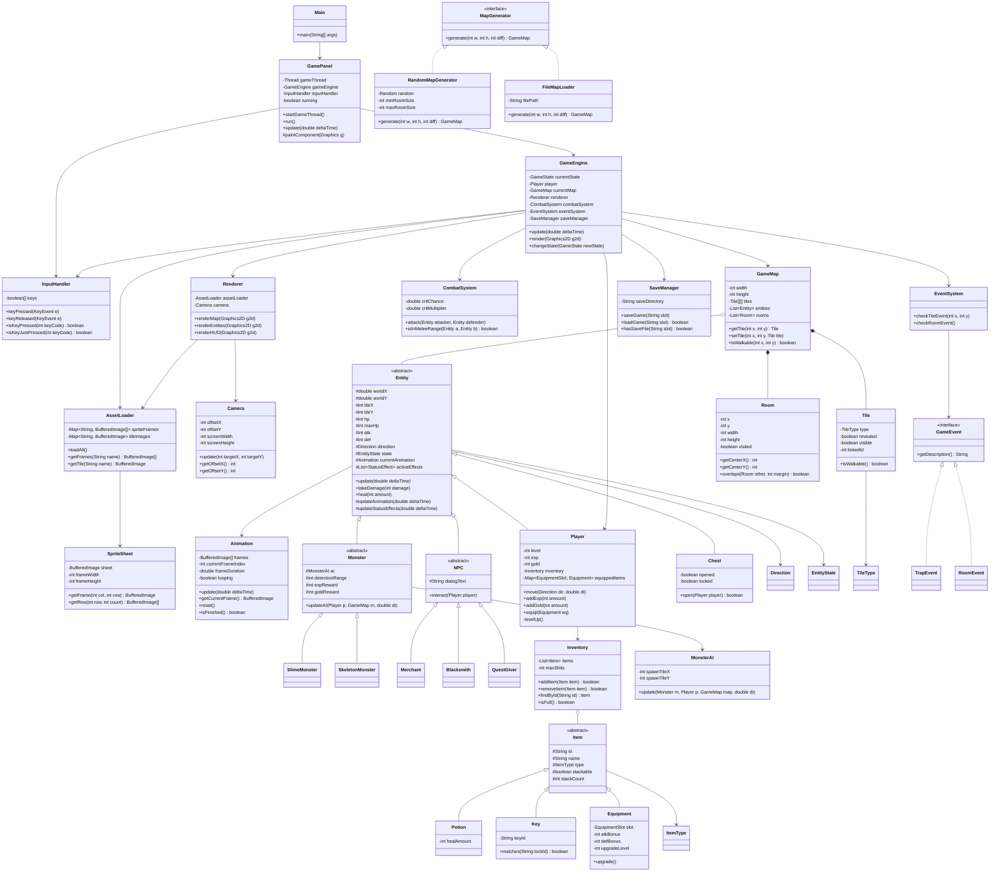

# Sơ đồ lớp — Terra Incognita

## Class Diagram tổng quan

## Quan hệ chính

| Quan hệ | Mô tả |
|---------|-------|
| `Entity ← Player` | Kế thừa — Player là Entity có thêm Level, EXP, Inventory |
| `Entity ← Monster ← Slime/Skeleton` | Kế thừa 2 cấp — đa hình cho nhiều loại quái |
| `Entity ← NPC ← Merchant/Blacksmith/QuestGiver` | Kế thừa — mỗi NPC override interact() |
| `MapGenerator → RandomMapGenerator / FileMapLoader` | Interface — Strategy pattern sinh map |
| `GameEngine → GameState` | State Machine — điều khiển luồng game |
| `Player ◇── Inventory ◇── Item[]` | Composition — Player sở hữu Inventory chứa Item |
| `GameMap ◇── Tile[][]` | Composition — Map chứa lưới Tile |
| `Monster → MonsterAI` | Delegation — AI tách riêng khỏi Monster |
