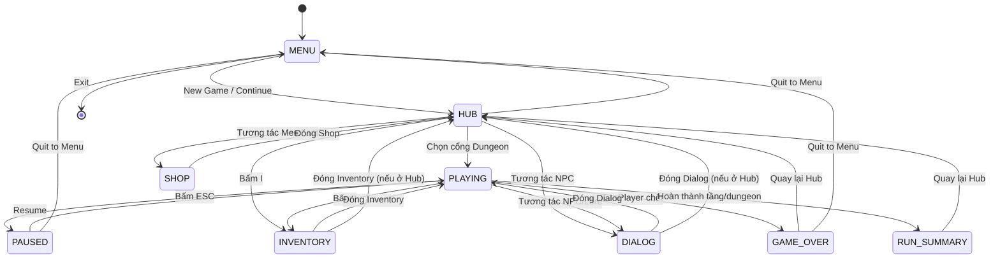
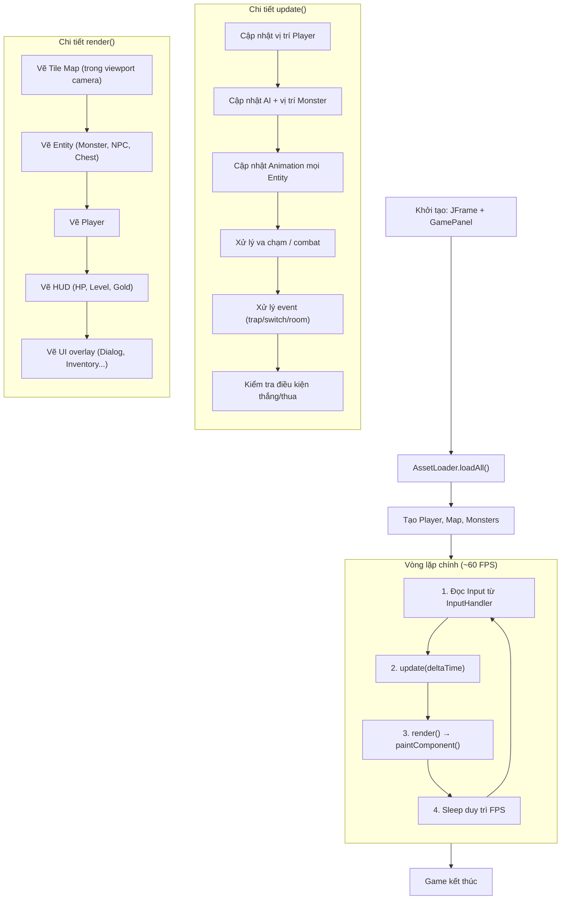
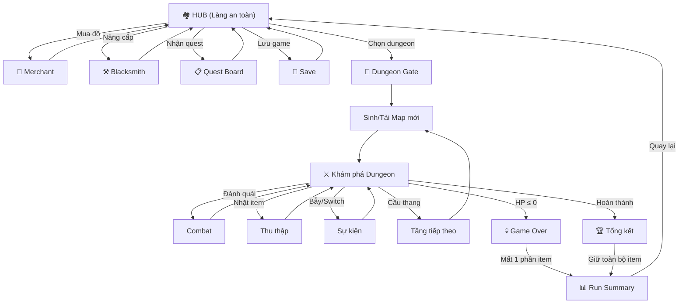
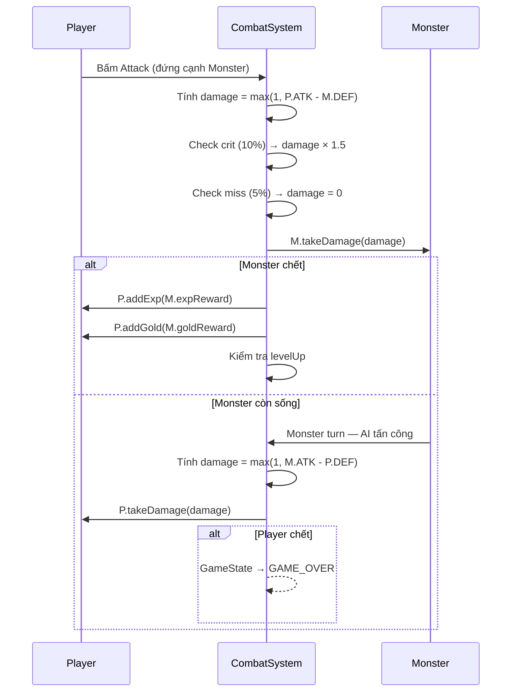

# Luồng Game — Terra Incognita

## 1. State Machine — Trạng thái game

```mermaid
stateDiagram-v2
    [*] --> MENU

    MENU --> HUB : New Game / Continue
    MENU --> [*] : Exit

    HUB --> PLAYING : Chọn cổng Dungeon
    HUB --> SHOP : Tương tác Merchant
    HUB --> INVENTORY : Bấm I
    HUB --> DIALOG : Tương tác NPC
    HUB --> MENU : Quit to Menu

    PLAYING --> PAUSED : Bấm ESC
    PLAYING --> INVENTORY : Bấm I
    PLAYING --> DIALOG : Tương tác NPC/Lore
    PLAYING --> GAME_OVER : Player chết
    PLAYING --> RUN_SUMMARY : Hoàn thành tầng/dungeon

    PAUSED --> PLAYING : Resume
    PAUSED --> MENU : Quit to Menu

    INVENTORY --> PLAYING : Đóng Inventory
    INVENTORY --> HUB : Đóng Inventory (nếu ở Hub)

    SHOP --> HUB : Đóng Shop

    DIALOG --> PLAYING : Đóng Dialog
    DIALOG --> HUB : Đóng Dialog (nếu ở Hub)

    GAME_OVER --> HUB : Quay lại Hub
    GAME_OVER --> MENU : Quit to Menu

    RUN_SUMMARY --> HUB : Quay lại Hub
```

## 2. Game Loop — Vòng lặp chính

```mermaid
flowchart TD
    START["Khởi tạo: JFrame + GamePanel"] --> LOAD["AssetLoader.loadAll()"]
    LOAD --> INIT["Tạo Player, Map, Monsters"]
    INIT --> LOOP

    subgraph LOOP ["Vòng lặp chính (~60 FPS)"]
        direction TB
        INPUT["1. Đọc Input từ InputHandler"]
        UPDATE["2. update(deltaTime)"]
        RENDER["3. render() → paintComponent()"]
        SLEEP["4. Sleep duy trì FPS"]

        INPUT --> UPDATE --> RENDER --> SLEEP
        SLEEP --> INPUT
    end

    subgraph UPDATE_DETAIL ["Chi tiết update()"]
        direction TB
        U1["Cập nhật vị trí Player"]
        U2["Cập nhật AI + vị trí Monster"]
        U3["Cập nhật Animation mọi Entity"]
        U4["Xử lý va chạm / combat"]
        U5["Xử lý event (trap/switch/room)"]
        U6["Kiểm tra điều kiện thắng/thua"]

        U1 --> U2 --> U3 --> U4 --> U5 --> U6
    end

    subgraph RENDER_DETAIL ["Chi tiết render()"]
        direction TB
        R1["Vẽ Tile Map (trong viewport camera)"]
        R2["Vẽ Entity (Monster, NPC, Chest)"]
        R3["Vẽ Player"]
        R4["Vẽ HUD (HP, Level, Gold)"]
        R5["Vẽ UI overlay (Dialog, Inventory...)"]

        R1 --> R2 --> R3 --> R4 --> R5
    end

    LOOP --> END["Game kết thúc"]
```

## 3. Vòng lặp Roguelike (Hub → Dungeon → Hub)

```mermaid
flowchart TD
    HUB["🏘️ HUB (Làng an toàn)"]
    HUB --> |"Mua đồ"| SHOP["🛒 Merchant"]
    HUB --> |"Nâng cấp"| SMITH["⚒️ Blacksmith"]
    HUB --> |"Nhận quest"| QUEST["📋 Quest Board"]
    HUB --> |"Lưu game"| SAVE["💾 Save"]
    HUB --> |"Chọn dungeon"| GATE["🚪 Dungeon Gate"]

    SHOP --> HUB
    SMITH --> HUB
    QUEST --> HUB
    SAVE --> HUB

    GATE --> GENERATE["Sinh/Tải Map mới"]
    GENERATE --> EXPLORE["⚔️ Khám phá Dungeon"]

    EXPLORE --> |"Đánh quái"| COMBAT["Combat"]
    EXPLORE --> |"Nhặt item"| LOOT["Thu thập"]
    EXPLORE --> |"Bẫy/Switch"| EVENT["Sự kiện"]
    EXPLORE --> |"Cầu thang"| NEXT["Tầng tiếp theo"]

    COMBAT --> EXPLORE
    LOOT --> EXPLORE
    EVENT --> EXPLORE
    NEXT --> GENERATE

    EXPLORE --> |"HP ≤ 0"| DEATH["💀 Game Over"]
    EXPLORE --> |"Hoàn thành"| WIN["🏆 Tổng kết"]

    DEATH --> |"Mất 1 phần item"| SUMMARY["📊 Run Summary"]
    WIN --> |"Giữ toàn bộ item"| SUMMARY

    SUMMARY --> |"Quay lại"| HUB
```

## 4. Luồng Combat (Turn-based)

```mermaid
sequenceDiagram
    participant P as Player
    participant CS as CombatSystem
    participant M as Monster

    P->>CS: Bấm Attack (đứng cạnh Monster)
    CS->>CS: Tính damage = max(1, P.ATK - M.DEF)
    CS->>CS: Check crit (10%) → damage × 1.5
    CS->>CS: Check miss (5%) → damage = 0
    CS->>M: M.takeDamage(damage)

    alt Monster chết
        CS->>P: P.addExp(M.expReward)
        CS->>P: P.addGold(M.goldReward)
        CS->>CS: Kiểm tra levelUp
    else Monster còn sống
        M->>CS: Monster turn — AI tấn công
        CS->>CS: Tính damage = max(1, M.ATK - P.DEF)
        CS->>P: P.takeDamage(damage)

        alt Player chết
            CS-->>CS: GameState → GAME_OVER
        end
    end
```
